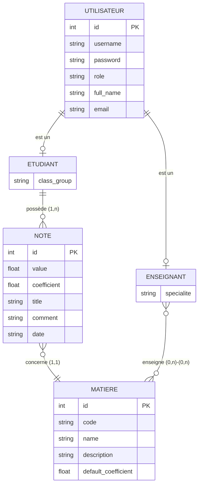
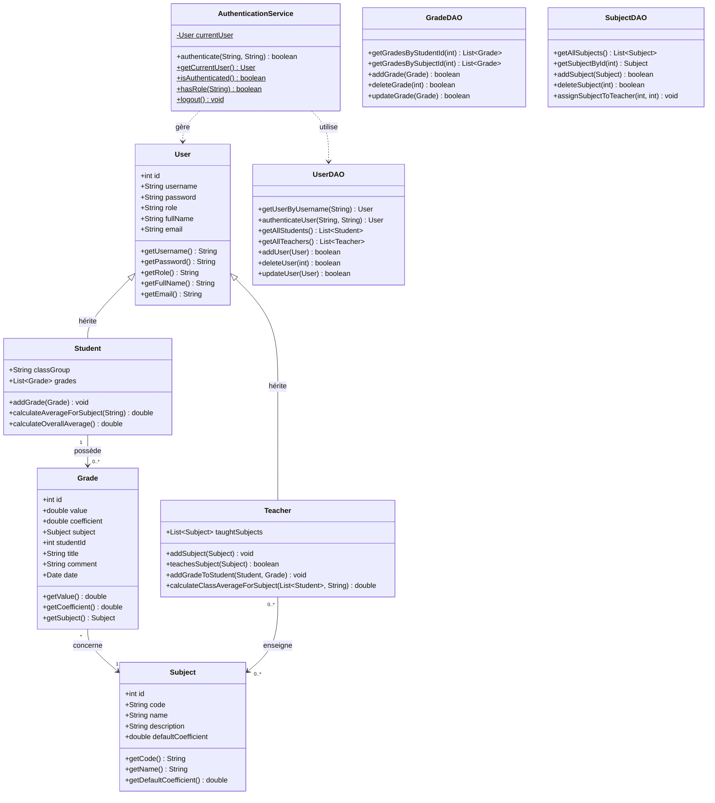
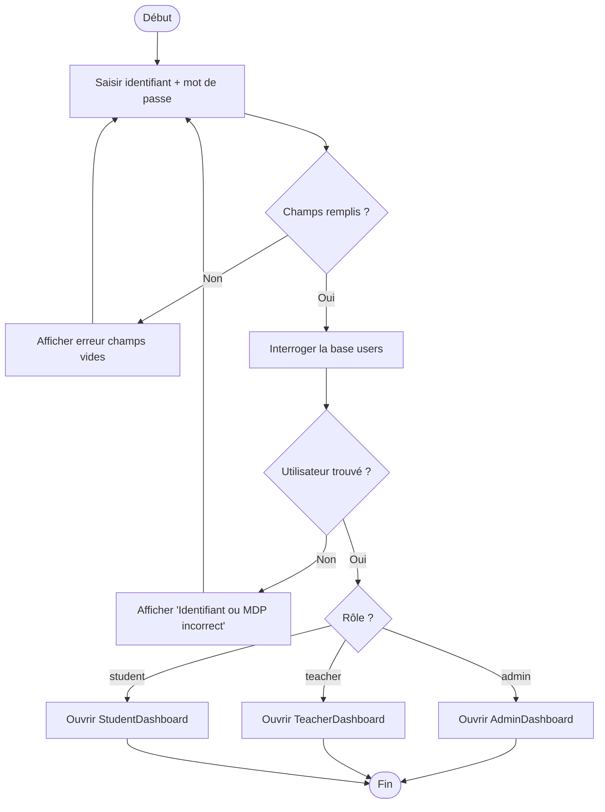
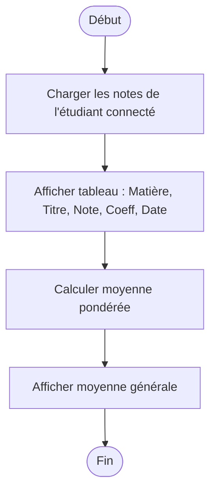
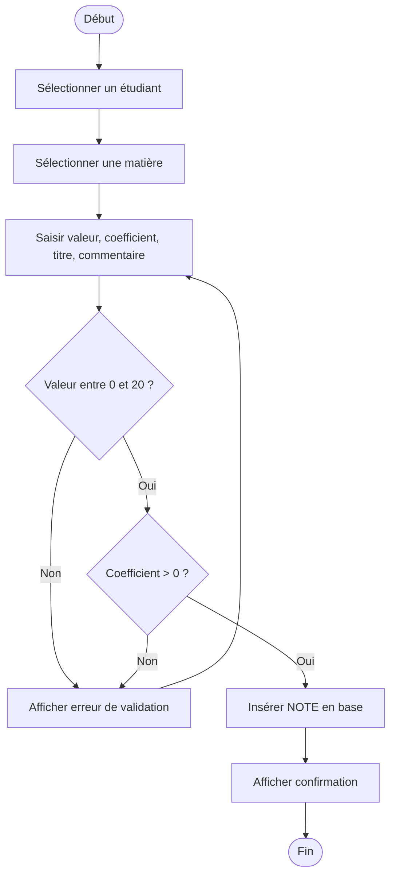
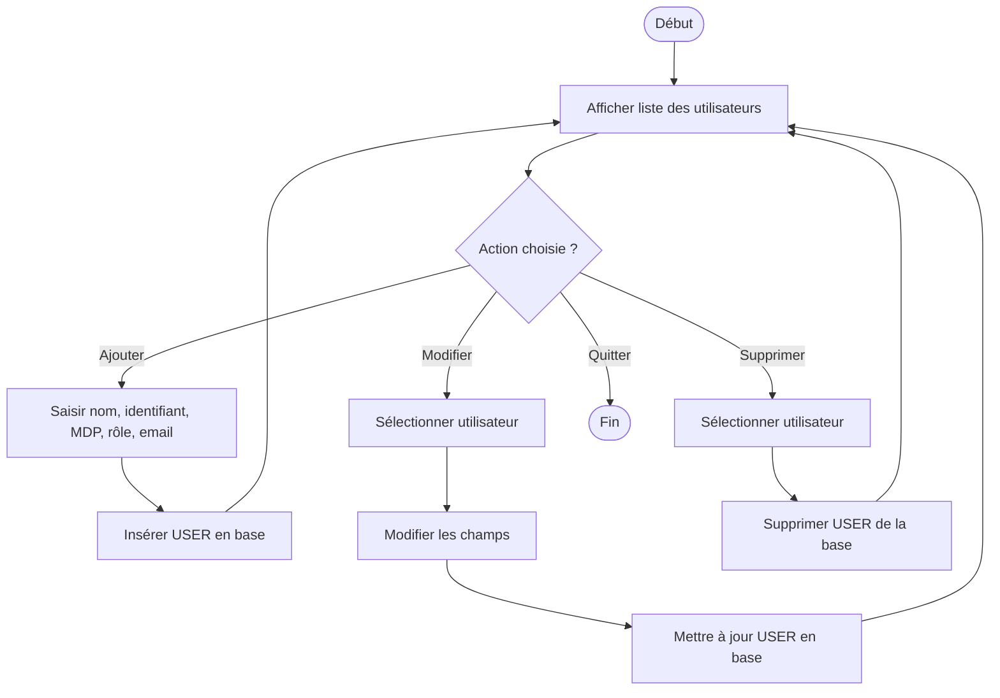

# GraduationNotes — Gestionnaire de Notes Scolaires


Application desktop de gestion de notes scolaires développée en Java (Swing + SQLite).  
Projet de fin d'année BTS SIO SLAM — supporte trois rôles utilisateurs : **Administrateur**, **Enseignant** et **Étudiant**.

> ⚠️ **Avertissement sécurité** : cette application contient des vulnérabilités intentionnelles à des fins pédagogiques (audit OWASP Top 10). **Ne pas déployer en production.**

---

## Table des matières

1. [Contexte du projet](#1-contexte-du-projet)
2. [Fonctionnalités par rôle](#2-fonctionnalités-par-rôle)
3. [Stack technique](#3-stack-technique)
4. [Architecture du projet](#4-architecture-du-projet)
5. [MCD — Modèle Conceptuel des Données](#5-mcd--modèle-conceptuel-des-données)
6. [Diagramme de classes UML](#6-diagramme-de-classes-uml)
7. [MCT — Modèle Conceptuel des Traitements](#7-mct--modèle-conceptuel-des-traitements)
8. [Dictionnaire de données](#8-dictionnaire-de-données)
9. [Règles de gestion métier](#9-règles-de-gestion-métier)
10. [Gestion de projet — Agile / Scrum](#10-gestion-de-projet--agile--scrum)
11. [Plan de tests](#11-plan-de-tests)
12. [Installation et lancement](#12-installation-et-lancement)
13. [Identifiants par défaut](#13-identifiants-par-défaut)
14. [Roadmap](#14-roadmap)

---

## 1. Contexte du projet

### Cadre pédagogique

Ce projet est réalisé dans le cadre du **BTS SIO option SLAM** (Solutions Logicielles et Applications Métier), dont l'objectif est de démontrer la maîtrise des compétences suivantes :

| Compétence | Mise en œuvre dans le projet |
|---|---|
| Développement d'une application multi-couches | Architecture Model / DAO / UI / Security |
| Conception de base de données relationnelle | Merise (MCD, MCT, dictionnaire de données) |
| Gestion de projet Agile | Scrum : backlog, sprints, user stories |
| Audit de sécurité applicative | Identification des failles OWASP Top 10 |
| Modélisation UML | Diagramme de classes, MCT |

### Objectifs de l'application

- Permettre à un **administrateur** de gérer les utilisateurs et les matières
- Permettre à un **enseignant** de saisir et consulter les notes de ses élèves
- Permettre à un **étudiant** de consulter ses propres notes et ses moyennes pondérées
- Illustrer les risques de sécurité courants (injection SQL, mots de passe en clair, absence de contrôle d'accès) pour leur analyse en cours de cybersécurité

---

## 2. Fonctionnalités par rôle

| Fonctionnalité | Administrateur | Enseignant | Étudiant |
|---|:---:|:---:|:---:|
| Se connecter | ✅ | ✅ | ✅ |
| Créer un utilisateur | ✅ | ❌ | ❌ |
| Modifier un utilisateur | ✅ | ❌ | ❌ |
| Supprimer un utilisateur | ✅ | ❌ | ❌ |
| Consulter tous les utilisateurs | ✅ | ❌ | ❌ |
| Créer / modifier / supprimer une matière | ✅ | ❌ | ❌ |
| Saisir une note | ✅ | ✅ | ❌ |
| Modifier une note | ✅ | ✅ | ❌ |
| Supprimer une note | ✅ | ✅ | ❌ |
| Consulter toutes les notes | ✅ | ✅ | ❌ |
| Consulter ses propres notes | ❌ | ❌ | ✅ |
| Voir sa moyenne pondérée | ❌ | ❌ | ✅ |
| Se déconnecter | ✅ | ✅ | ✅ |

---

## 3. Stack technique

| Composant | Technologie | Version |
|---|---|---|
| Langage | Java | JDK 8+ (testé JDK 23) |
| Interface graphique | Java Swing | Intégré au JDK |
| Base de données | SQLite | Fichier `notes.db` (embarqué) |
| Driver JDBC | sqlite-jdbc | 3.36.0.3 |
| IDE cible | Eclipse IDE | 2023-09+ |
| Gestion de dépendances | Classpath manuel | `lib/` |
| Contrôle de version | Git | — |

---

## 4. Architecture du projet

### Arborescence

```
GraduationNotes/
├── src/
│   ├── Main.java                        # Point d'entrée — init DB + lancement UI
│   ├── dao/
│   │   ├── DatabaseConnection.java      # Connexion SQLite + init schéma
│   │   ├── UserDAO.java                 # CRUD utilisateurs
│   │   ├── GradeDAO.java                # CRUD notes
│   │   └── SubjectDAO.java              # CRUD matières + affectation enseignant
│   ├── model/
│   │   ├── User.java                    # Entité de base (id, username, password, role)
│   │   ├── Student.java                 # Hérite User — classGroup, grades[]
│   │   ├── Teacher.java                 # Hérite User — taughtSubjects[]
│   │   ├── Subject.java                 # Matière (code, name, coefficient)
│   │   └── Grade.java                   # Note (value, coefficient, subject, studentId)
│   ├── security/
│   │   └── AuthenticationService.java   # Authentification + session utilisateur
│   ├── ui/
│   │   ├── LoginFrame.java              # Fenêtre de connexion
│   │   ├── AdminDashboard.java          # Tableau de bord administrateur
│   │   ├── TeacherDashboard.java        # Tableau de bord enseignant
│   │   └── StudentDashboard.java        # Tableau de bord étudiant
│   └── utils/
│       └── DatabaseInitializer.java     # Peuplement initial de la base (données de test)
├── lib/
│   └── sqlite-jdbc-3.36.0.3.jar        # Driver SQLite
├── bin/                                 # Fichiers .class compilés (généré par Eclipse)
└── README.md
```

### Description des couches

| Couche | Package | Responsabilité |
|---|---|---|
| **Modèle** | `model` | Représentation des entités métier (POJO) |
| **Accès aux données** | `dao` | Requêtes SQL, connexion, CRUD |
| **Sécurité** | `security` | Authentification, gestion de session |
| **Interface** | `ui` | Fenêtres Swing, interaction utilisateur |
| **Utilitaires** | `utils` | Initialisation et peuplement de la base |

---

## 5. MCD — Modèle Conceptuel des Données

> Modélisation Merise des entités et associations du domaine.



### Cardinalités Merise

| Association | Entité A | Cardinalité A | Cardinalité B | Entité B |
|---|---|:---:|:---:|---|
| est un | UTILISATEUR | 1,1 | 0,1 | ETUDIANT |
| est un | UTILISATEUR | 1,1 | 0,1 | ENSEIGNANT |
| possède | ETUDIANT | 1,1 | 0,n | NOTE |
| concerne | NOTE | 1,1 | 0,n | MATIERE |
| enseigne | ENSEIGNANT | 0,n | 0,n | MATIERE |

---

## 6. Diagramme de classes UML



---

## 7. MCT — Modèle Conceptuel des Traitements

### Processus 1 — SE CONNECTER



### Processus 2 — CONSULTER LES NOTES (Étudiant)



### Processus 3 — SAISIR UNE NOTE (Enseignant)



### Processus 4 — GÉRER LES UTILISATEURS (Administrateur)



---

## 8. Dictionnaire de données

### Table `users`

| Attribut | Nom SQL | Type | Longueur | Contrainte | Description |
|---|---|---|:---:|---|---|
| Identifiant technique | `id` | INTEGER | — | PK, AUTOINCREMENT | Clé primaire auto-générée |
| Nom d'utilisateur | `username` | TEXT | 50 | NOT NULL, UNIQUE | Identifiant de connexion |
| Mot de passe | `password` | TEXT | 100 | NOT NULL | Mot de passe (texte clair — à hacher en v1.1) |
| Rôle | `role` | TEXT | 20 | NOT NULL | `admin`, `teacher` ou `student` |
| Nom complet | `full_name` | TEXT | 100 | NOT NULL | Prénom et nom de l'utilisateur |
| Adresse email | `email` | TEXT | 100 | — | Email de contact |
| Groupe de classe | `class_group` | TEXT | 20 | — | Classe (ex: `Class A`) — renseigné pour les étudiants uniquement |

### Table `subjects`

| Attribut | Nom SQL | Type | Longueur | Contrainte | Description |
|---|---|---|:---:|---|---|
| Identifiant technique | `id` | INTEGER | — | PK, AUTOINCREMENT | Clé primaire |
| Code matière | `code` | TEXT | 20 | NOT NULL, UNIQUE | Code court (ex: `MATH101`) |
| Libellé | `name` | TEXT | 100 | NOT NULL | Nom complet de la matière |
| Description | `description` | TEXT | 255 | — | Description pédagogique |
| Coefficient par défaut | `default_coefficient` | REAL | — | DEFAULT 1.0 | Coefficient appliqué par défaut aux notes |

### Table `grades`

| Attribut | Nom SQL | Type | Longueur | Contrainte | Description |
|---|---|---|:---:|---|---|
| Identifiant technique | `id` | INTEGER | — | PK, AUTOINCREMENT | Clé primaire |
| Valeur de la note | `value` | REAL | — | NOT NULL | Note entre 0 et 20 |
| Coefficient | `coefficient` | REAL | — | DEFAULT 1.0 | Poids de la note dans la moyenne |
| Matière | `subject_id` | INTEGER | — | FK → subjects(id), NOT NULL | Matière évaluée |
| Étudiant | `student_id` | INTEGER | — | FK → users(id), NOT NULL | Étudiant concerné |
| Titre de l'évaluation | `title` | TEXT | 100 | — | Nom de l'évaluation (ex: `DS n°1`) |
| Commentaire | `comment` | TEXT | 255 | — | Observations de l'enseignant |
| Date | `date` | TEXT | — | — | Date de l'évaluation (format `YYYY-MM-DD`) |

### Table `teacher_subjects` (association)

| Attribut | Nom SQL | Type | Contrainte | Description |
|---|---|---|---|---|
| Enseignant | `teacher_id` | INTEGER | FK → users(id), NOT NULL | Référence de l'enseignant |
| Matière | `subject_id` | INTEGER | FK → subjects(id), NOT NULL | Référence de la matière enseignée |

---

## 9. Règles de gestion métier

| ID | Règle | Acteur concerné |
|---|---|---|
| RG-01 | Un étudiant ne peut consulter que ses propres notes | Étudiant |
| RG-02 | Un enseignant ne peut saisir une note que pour une matière qu'il enseigne | Enseignant |
| RG-03 | La valeur d'une note doit être comprise entre 0 et 20 inclus | Tous |
| RG-04 | Le coefficient d'une note doit être strictement supérieur à 0 | Tous |
| RG-05 | Un utilisateur doit posséder un identifiant unique dans le système | Administrateur |
| RG-06 | L'authentification nécessite la saisie d'un identifiant et d'un mot de passe | Tous |
| RG-07 | Un étudiant appartient à un seul groupe de classe | Administrateur |
| RG-08 | Un enseignant peut enseigner plusieurs matières | Administrateur |
| RG-09 | Une matière peut être enseignée par plusieurs enseignants | Administrateur |
| RG-10 | La suppression d'un utilisateur entraîne la suppression de ses notes associées | Administrateur |
| RG-11 | La moyenne pondérée se calcule par : `Σ(note × coefficient) / Σ(coefficients)` | Étudiant |
| RG-12 | Seul l'administrateur peut créer, modifier ou supprimer des comptes utilisateurs | Administrateur |

---

## 10. Gestion de projet — Agile / Scrum

### Équipe Scrum

| Rôle | Personne | Responsabilité |
|---|---|---|
| Product Owner | Professeur encadrant | Définit les besoins, valide les livraisons |
| Scrum Master | Étudiant référent | Facilite les cérémonies, lève les blocages |
| Dev Team | Équipe étudiante | Conception, développement, tests |

### Product Backlog

Les user stories sont priorisées selon la méthode **MoSCoW** (Must / Should / Could / Won't).

| ID | User Story | Priorité | Points |
|---|---|:---:|:---:|
| US-01 | En tant qu'utilisateur, je veux me connecter avec mon identifiant et mot de passe | Must | 3 |
| US-02 | En tant qu'étudiant, je veux consulter mes notes par matière | Must | 5 |
| US-03 | En tant qu'étudiant, je veux voir ma moyenne pondérée globale | Must | 3 |
| US-04 | En tant qu'enseignant, je veux saisir une note pour un étudiant | Must | 5 |
| US-05 | En tant qu'enseignant, je veux modifier ou supprimer une note existante | Must | 3 |
| US-06 | En tant qu'administrateur, je veux créer un compte utilisateur | Must | 5 |
| US-07 | En tant qu'administrateur, je veux modifier ou supprimer un utilisateur | Must | 3 |
| US-08 | En tant qu'administrateur, je veux gérer les matières (CRUD) | Must | 5 |
| US-09 | En tant qu'utilisateur, je veux me déconnecter de l'application | Should | 1 |
| US-10 | En tant qu'enseignant, je veux voir la liste de mes étudiants | Should | 3 |
| US-11 | En tant qu'enseignant, je veux voir les matières que j'enseigne | Should | 2 |
| US-12 | En tant qu'administrateur, je veux consulter toutes les notes | Could | 2 |
| US-13 | En tant qu'utilisateur, je veux un message d'erreur clair en cas de mauvais identifiants | Should | 2 |
| US-14 | En tant qu'administrateur, je veux pouvoir réinitialiser la base de données | Won't | — |

### Sprint 0 — Setup et conception (1 semaine)

**Objectif** : Mise en place du projet, conception Merise, modélisation UML.

| Tâche | Durée estimée |
|---|---|
| Initialisation du projet Eclipse + Git | 2h |
| Rédaction du MCD et dictionnaire de données | 4h |
| Conception du diagramme de classes | 3h |
| Configuration SQLite + schéma de base | 2h |
| Rédaction du Product Backlog et planification des sprints | 2h |

### Sprint 1 — Authentification et CRUD de base (1 semaine)

**Objectif** : Authentification fonctionnelle, création des modèles, DAO opérationnels.

| User Story | Tâche technique | Points |
|---|---|:---:|
| US-01 | Modèles `User`, `Student`, `Teacher` | 3 |
| US-01 | `AuthenticationService` + `UserDAO.authenticateUser()` | 3 |
| US-06, US-07 | `UserDAO` CRUD complet | 5 |
| US-08 | `SubjectDAO` CRUD + `teacher_subjects` | 5 |
| US-04, US-05 | `GradeDAO` CRUD complet | 5 |
| — | `DatabaseInitializer` + données de test | 2 |

**Vélocité Sprint 1** : 23 points

### Sprint 2 — Interfaces utilisateur et intégration (1 semaine)

**Objectif** : Tableaux de bord Swing complets, intégration DAO/UI, tests fonctionnels.

| User Story | Tâche technique | Points |
|---|---|:---:|
| US-01 | `LoginFrame` avec routage par rôle | 3 |
| US-02, US-03 | `StudentDashboard` (notes + moyenne) | 5 |
| US-04, US-05, US-10, US-11 | `TeacherDashboard` (onglets notes / élèves / matières) | 8 |
| US-06, US-07, US-08, US-12 | `AdminDashboard` (onglets utilisateurs / matières / notes) | 8 |
| US-09, US-13 | Déconnexion + messages d'erreur | 2 |
| — | Tests fonctionnels + correctifs | 3 |

**Vélocité Sprint 2** : 29 points

---

## 11. Plan de tests

### Niveau 1 — Tests unitaires

| ID | Classe testée | Méthode | Cas nominal | Cas d'erreur |
|---|---|---|---|---|
| TU-01 | `Student` | `calculateOverallAverage()` | 4 notes → moyenne correcte | Aucune note → retourne 0.0 |
| TU-02 | `Student` | `calculateAverageForSubject()` | Notes filtrées par matière | Matière inconnue → retourne 0.0 |
| TU-03 | `Teacher` | `teachesSubject()` | Matière enseignée → `true` | Matière non enseignée → `false` |
| TU-04 | `Grade` | Constructeur | Tous les champs renseignés | `value` hors [0;20] → exception attendue |
| TU-05 | `Subject` | `getDefaultCoefficient()` | Coefficient initialisé à 1.0 | Coefficient à 0 → règle RG-04 violée |

### Niveau 2 — Tests d'intégration

| ID | Classe testée | Méthode | Cas nominal | Cas d'erreur |
|---|---|---|---|---|
| TI-01 | `UserDAO` | `addUser()` | Insertion en base → retourne `true` | Username dupliqué → `false` (UNIQUE) |
| TI-02 | `UserDAO` | `authenticateUser()` | Credentials corrects → objet `User` | Mauvais MDP → retourne `null` |
| TI-03 | `GradeDAO` | `addGrade()` | Note insérée → récupérable par `getGradesByStudentId()` | `student_id` inexistant → FK violation |
| TI-04 | `SubjectDAO` | `assignSubjectToTeacher()` | Ligne insérée dans `teacher_subjects` | Association dupliquée → gérée silencieusement |
| TI-05 | `AuthenticationService` | `authenticate()` | `currentUser` renseigné après succès | Échec → `currentUser` reste `null` |

### Niveau 3 — Tests fonctionnels (UI)

| ID | Scénario | Étapes | Résultat attendu |
|---|---|---|---|
| TF-01 | Connexion admin | Saisir `admin` / `admin123` → cliquer Se connecter | `AdminDashboard` s'ouvre |
| TF-02 | Connexion enseignant | Saisir `teacher1` / `teacher123` | `TeacherDashboard` s'ouvre |
| TF-03 | Connexion étudiant | Saisir `student1` / `student123` | `StudentDashboard` s'ouvre |
| TF-04 | Mauvais identifiants | Saisir `admin` / `mauvais` | Message "Identifiant ou mot de passe incorrect" |
| TF-05 | Saisie de note | Enseignant → onglet Ajouter → remplir le formulaire → valider | Note visible dans la liste de l'étudiant |
| TF-06 | Consultation notes étudiant | Étudiant connecté → dashboard | Notes et moyenne affichées correctement |
| TF-07 | Suppression utilisateur | Admin → onglet Utilisateurs → supprimer student4 | student4 absent de la liste |

---

## 12. Installation et lancement

### Prérequis

- **JDK 8 ou supérieur** installé et configuré dans le PATH (testé avec JDK 23)
- **Eclipse IDE** 2023-09 ou supérieur (ou IntelliJ IDEA, VS Code + Extension Pack for Java)
- Aucun serveur de base de données requis — SQLite est embarqué

### Étapes

1. **Cloner le dépôt**
   ```bash
   git clone https://github.com/<votre-compte>/GraduationNotes.git
   cd GraduationNotes
   ```

2. **Importer dans Eclipse**
   - `File > Import > Existing Projects into Workspace`
   - Sélectionner le dossier racine du projet
   - Cocher `Copy projects into workspace` si nécessaire

3. **Configurer le classpath**
   - Clic droit sur le projet → `Build Path > Configure Build Path`
   - Onglet `Libraries > Add JARs`
   - Sélectionner `lib/sqlite-jdbc-3.36.0.3.jar`
   - Valider avec `Apply and Close`

4. **Lancer l'application**
   - Ouvrir `src/Main.java`
   - Clic droit → `Run As > Java Application`
   - La base `notes.db` est créée et peuplée automatiquement au premier démarrage

5. **Nettoyage de la base** (si nécessaire)
   - Supprimer le fichier `notes.db` à la racine du projet
   - Relancer l'application pour regénérer les données initiales

---

## 13. Identifiants par défaut

Ces comptes sont créés automatiquement par `DatabaseInitializer` au premier lancement.

| Rôle | Identifiant | Mot de passe | Nom complet | Classe |
|---|---|---|---|---|
| Administrateur | `admin` | `admin123` | Administrator | — |
| Enseignant | `teacher1` | `teacher123` | John Smith | — |
| Enseignant | `teacher2` | `teacher123` | Jane Doe | — |
| Étudiant | `student1` | `student123` | Alice Johnson | Class A |
| Étudiant | `student2` | `student123` | Bob Williams | Class A |
| Étudiant | `student3` | `student123` | Charlie Brown | Class B |
| Étudiant | `student4` | `student123` | Diana Miller | Class B |

### Affectations matières — enseignants

| Enseignant | Matières enseignées |
|---|---|
| `teacher1` (John Smith) | Mathématiques (MATH101), Physique (PHYS101) |
| `teacher2` (Jane Doe) | Informatique (CS101), Anglais (ENG101), Histoire (HIST101) |

---

## 14. Roadmap

### v1.0 — Version actuelle (TP BTS SIO)

- [x] Authentification par identifiant / mot de passe
- [x] Tableaux de bord Admin, Enseignant, Étudiant
- [x] CRUD complet : utilisateurs, matières, notes
- [x] Calcul de moyenne pondérée
- [x] Base SQLite embarquée avec données de test
- [x] Failles OWASP intentionnelles documentées pour audit pédagogique

### v1.1 — Sécurisation (amélioration post-TP)

- [ ] Remplacement de `JTextField` par `JPasswordField` pour la saisie du mot de passe
- [ ] Hashage des mots de passe avec **BCrypt** avant stockage
- [ ] Remplacement de toutes les requêtes SQL par des `PreparedStatement` (anti-injection SQL)
- [ ] Suppression des logs contenant des informations sensibles (identifiants, requêtes)
- [ ] Mise en place d'un contrôle d'accès strict par rôle dans les DAOs
- [ ] Validation des entrées utilisateur (longueur, format, plages de valeurs)

### v2.0 — Version web (Jakarta EE / Spring Boot)

- [ ] Migration de l'interface Swing vers une application web (Thymeleaf ou React)
- [ ] Remplacement de SQLite par **PostgreSQL** ou **MySQL**
- [ ] API REST sécurisée (JWT / OAuth2)
- [ ] Déploiement sur serveur (Tomcat / Spring Boot embedded)
- [ ] Gestion de sessions web avec timeout
- [ ] Export des bulletins de notes en PDF
│   │   ├── AdminDashboard.java          # Interface administrateur
│   │   ├── TeacherDashboard.java        # Interface enseignant
│   │   └── StudentDashboard.java        # Interface etudiant
│   └── utils/
│       └── DatabaseInitializer.java     # Initialisation et seed BDD
├── lib/
│   └── sqlite-jdbc-3.36.0.3.jar
├── bin/                                 # Bytecode compile (Eclipse)
└── notes.db                             # Base de donnees SQLite (generee)
```

---

## Modele de donnees

```
User (id, username, password, role, fullName, email)
 ├── Student (classGroup, grades[])
 └── Teacher (taughtSubjects[])

Subject (id, code, name, description, defaultCoefficient)

Grade (id, value, coefficient, title, comment, date, studentId->User, subject->Subject)

teacher_subjects (teacher_id, subject_id)  <- table de jonction
```

---

## Contexte pedagogique -- TP Securite (BTS SIO SLAM)

Cette application est le support d'un TP d'audit de securite de 4h.
Elle contient des vulnerabilites intentionnelles couvrant plusieurs categories OWASP Top 10 :

- Injection SQL (requetes par concatenation de chaines)
- Mots de passe stockes en clair
- Controle d'acces insuffisant (IDOR)
- Journalisation de donnees sensibles
- Absence de protection contre le brute-force

### Deroulé du TP

**Etape 1 -- Decouverte (1h)**
Lancer l'application, explorer les fonctionnalites, identifier les comportements suspects.

**Etape 2 -- Audit (1h30)**
Lire les parties critiques du code source, identifier les failles, evaluer leur criticite (faible / moyen / eleve), les referencer avec l'OWASP Top 10.

Livrable : rapport d'audit (liste des failles, criticite, pistes de correction, references OWASP, consequences potentielles).

**Etape 3 -- Corrections (1h30)**
Choisir 2 a 3 failles critiques, les corriger proprement, tester, documenter avant/apres.

Livrable : rapport d'intervention (contexte, actions techniques, preuves de correction, retour d'experience, suggestions).

**Dossier a remettre** : projet modifie + rapport d'audit + rapport d'intervention (PDF ou `.md`).

---
